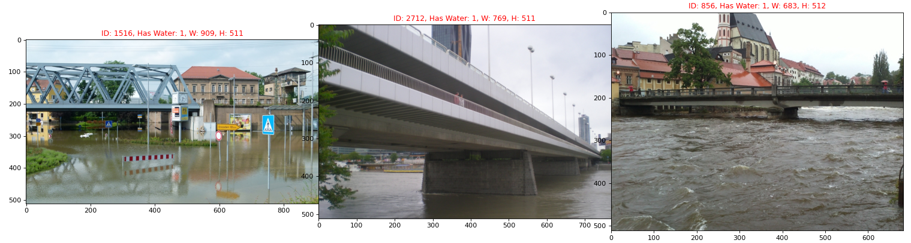

# Used Datasets

## Preparing the dataset

This approach uses DCNN implementations to detect flood waters on surveillance images seen from the perspective of cell phones. To demonstrate the approach, we trained the DCNN on **1948** flooding images collected from the Internet and manually labeled (CARLO, carlo.navarra@liu.se) and applied it to ....

To provide examples of dry ground, **xxx** images of urban landscape without flooding was added from the Cityscapes dataset.

As input, the network takes color images with a resolution of 256 pixels × xxx pixels

| Command | Arguments |Images | Annotation | Description |
| ---| --- |--- |--- | --- |
| ```./euflood.sh``` [here](../euflood.sh) | source, flooding, out| 252 images | eu2013.csv | Read original images and flooding annotation; rename the images and create new CSV-annotation file|


| Command | Description |
| ------------------------------------ | ------------------------------------- |
| ```python3 desktop_and_mobile_parser.py -source [path to the dataset]``` |Read original images, rename and create CSV|
| ```python3 roadway_parser.py -source [path to the dataset]``` |Read original images, rename and create CSV|
| ```python3 random_file_selection.py -source [path to the dataset] -json [path to annotation files] -dest [output] -n [Number of randomly selected images]``` |Read Images and annotation from CityScape dataset (from images and labels)/ rename and create CSV|
|```./euflood.sh``` [here](../euflood.sh) |Read all images from the specific folder and copy it with changed names into **0**, **1**, **full** folder; creating **csv** annotation file |


| Command | Description |
| ------------------------------------ | ------------------------------------- |
| ```python3 src/desktop_mobile/parser.py -source [path to the dataset] -out [path to the output folder]```  $^{1)}$ | Parser for Desktop and Mobile|
|```python3 src/random_plot.py -source [path to parsed dataset] -csv [path to csv]```   $^{2)}$ | Random Plot of the images in sellected dataset|
1)```python3 src/desktop_mobile/parser.py -source /media/igofed/SSD_1T/AI4CI/Carlo/desktop_old``` - if out not specified the result will be in the project folder
2)```python3 src/desktop_mobile/parser.py -source /temp_2022_09_28_19_53_30/image -csv=/2022_09_28_19_53_30.csv```

### 1. Flooded images from Carlo's dataset
####1.1. Desktop


####1.2. Mobile


### 1. Flooded images from the EU flood dataset

**'https://github.com/cvjena/eu-flood-dataset'** </br>


All images from Carlo has to be collected into one image folder **Desktop**. Two sourse csv annotation files are combined manually into the one and remain as **dataset.csv**.</br>
File structure look like:</br>
**In Total: 3235 images*, 2672 of the with water, 563 consist no water ** </br>
All images has different resolution and has to be transformed before train.

|Dataset| Image|
|-|-|
| ```python3 desktop_and_mobile_parser.py -source [path to the dataset]```                                                                                    | Read original images, rename and create CSV                                                       |
| ```python3 roadway_parser.py -source [path to the dataset]```                                                                                               | Read original images, rename and create CSV                                                       |
| ```python3 random_file_selection.py -source [path to the dataset] -json [path to annotation files] -dest [output] -n [Number of randomly selected images]``` | Read Images and annotation from CityScape dataset (from images and labels)/ rename and create CSV |


|Dataset     |Image_ID | TimeEvent | hasWater |lat |lon |Notes |
|------------| :-- | :-- | :-- | :-- | :-- | ------------------------------------ |
|desktop (1) |0000|1626213600000|1|50.4922 |5.8667|1947 (1904 / 43) frames in Desktop dataset (Carlo) |
|...|...|...|...|...| ...      |
|mobile (2) |0000|1614253405477|0|58.4059| 15.6012| 546 (327 / 219 )frames in Mobile dataset (Carlo)           |
|...|...|...|...|...| ...      |
|roadway (3) |0000|1652968461000| 1| 12.3456| 78.9012| 882 frames in Roadway Flooding Image Dataset with flooding |
|...|...|...|...|...| ...      |
|berlin (4)|0000 |1652951033000 |0|52.4955| 13.3086| 100 randomly selected frames in Berlin without flooding   |
|...|...|...|...|...| ...      |
|munich (5)|0000| 1652951171000|0 | 48.1619| 11.5864| 100 randomly selected frames in Munich without flooding   |
|...|...|...|...|...| ...      |
|mainz (6)|0000| 1652951706000| 0 | 50.0029| 8.27| 100 randomly selected frames in Mainz without flooding    |
|...|...|...|...|...| ...      |
|eu2013 (7)|0000| 1652951706000| 0 | 50.0029| 8.27| 252 frames from EU flooding image dataset    |
|...|...|...|...|...| ...      |


|...|...|...|...|...| ... | Total: 3676|

(1) **Desktop dataset** </br>```python3 desktop_and_mobile_parser.py -source /media/igofed/SSD_1T/AI4CI/Carlo/desktop_old/```

(2) **Mobile dataset** </br>```python3 desktop_and_mobile_parser.py -source /media/igofed/SSD_1T/AI4CI/Carlo/mobile_/```

(3) **'https://www.kaggle.com/datasets/saurabhshahane/roadway-flooding-image-dataset'** </br> This dataset consists of 441 annotated roadway flood images that can be used as training samples to train computer vision based flood detection algorithms. </br>
```python3 roadway_parser.py -source /media/igofed/SSD_1T/AI4CI/Carlo/roadway/Dataset/images/```

(4) **CityScape Dataset**</br>
```python3 random_file_selection.py -source /media/igofed/SSD_1T/AI4CI/leftImg8bit_trainvaltest/images/test/berlin -json /media/igofed/SSD_1T/AI4CI/leftImg8bit_trainvaltest/labels/test/berlin -n 100```

(5) **CityScape Dataset**</br>
```python3 random_file_selection.py -source /media/igofed/SSD_1T/AI4CI/leftImg8bit_trainvaltest/images/test/munich -json /media/igofed/SSD_1T/AI4CI/leftImg8bit_trainvaltest/labels/test/munich -n 100```

(6) **CityScape Dataset**</br>
```python3 random_file_selection.py -source /media/igofed/SSD_1T/AI4CI/leftImg8bit_trainvaltest/images/test/mainz -json /media/igofed/SSD_1T/AI4CI/leftImg8bit_trainvaltest/labels/test/mainz -n 100```
