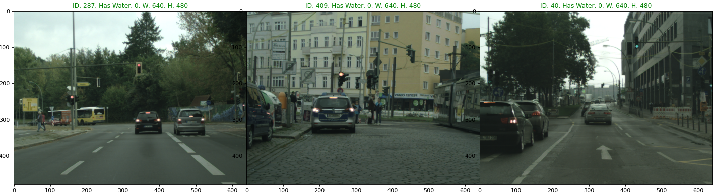
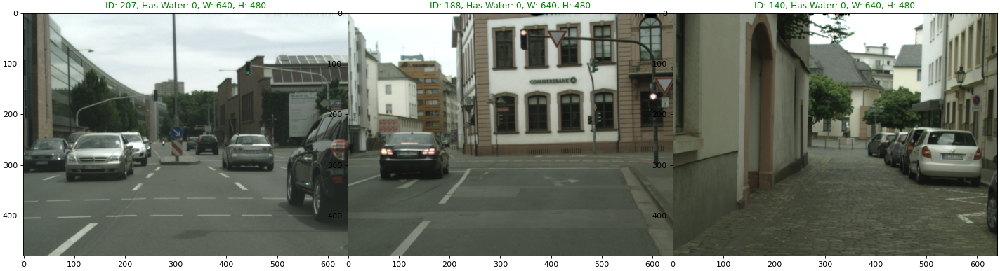

# Used Datasets

## Preparing the dataset

This approach uses DCNN implementations to detect flood waters on surveillance images seen from the perspective of cell phones. To demonstrate the approach, we trained the DCNN on **1947** flooding images collected from the Internet and manually labeled (CARLO,  https://liu.se/en/research/ai4climateadaptation) and applied it to ....

To provide examples of dry ground, **400** images of urban landscape without flooding was added from the Cityscapes dataset (in Berlin, Munich, Mainz and Bonn cities).
To provide more tests in CNN tuning we used **441** roadway flooding dataset.</br>
To provide more tests in CNN tuning we used **1549**  eu flooding Image dataset.</br>
**All used Commands to prepare the dataset**</br>
| Command | Description |
| ------------------------------------ | ------------------------------------- |
| ```python3 src/main_parser.py -source [path to the dataset] -dest [path to the output folder] -type [type of the available dataset]```| Parser for Desktop, Mobile, Roadway|
|```python3 src/euflood_parser.py -source [path to parsed dataset] -flooding [path to txt file] -dest [path to the output folder]```| Parser for eu flood 2013 dataset|
|```python3 src/random_plot.py -source [path to parsed dataset] -csv [name of csv]```| Random Plot of the images in selected dataset|
|```python3 src/random_file_selection.py -source [path to parsed dataset] -dest [path to the output folder] -type [type of the available dataset] -n [num of randomly sellected images]```|Parser for CytyScape dataset|


|Dataset     |Image_ID | TimeEvent | hasWater |lat |lon | Flood Images | No-Flood Images | Total |Notes |
|------------| :-- | :-- | :-- | :-- | :-- |:-- |:-- |:-- | ------------------------------------ |
|desktop |0000|1626213600000|1|50.4922 |5.8667|1907|40|1947|Desktop dataset (Carlo) $^{1)}$ |
|...|...|...|...|...|...|...|...| ... | ...|
|mobile |0000|1614253405477|0|58.4059| 15.6012| 219 |327 | 546 | Mobile dataset (Carlo) $^{2)}$ |
|...|...|...|...|...|...|...|...| ... | ...|
|roadway |0000|1652968461000| 1| 12.3456| 78.9012| 441 | 0| 441|Roadway Flooding Image Dataset $^{3)}$ |
|...|...|...|...|...|...|...|...| ... | ...|
|eu2013 |0000|1664719834000| 1| 12.3456| 78.9012| 1549 | 313| 1862|EU Flooding 2013 Dataset $^{4)}$ |
|...|...|...|...|...|...|...|...| ... | ...|
|berlin |0000 |1652951033000 |0|52.4955| 13.3086| 0|300| 300| randomly selected frames in Berlin without flooding $^{5)}$  |
|...|...|...|...|...|...|...|...| ... | ...|
|munich |0000 |1652951033000 |0|52.4955| 13.3086| 0|200| 200| randomly selected frames in Munich without flooding $^{6)}$  |
|...|...|...|...|...|...|...|...| ... | ...|
|mainz |0000 |1652951033000 |0|52.4955| 13.3086| 0|150| 150| randomly selected frames in Mainz without flooding $^{7)}$  |
|...|...|...|...|...|...|...|...| ... | ...|
|bonn |0000 |1652951033000 |0|52.4955| 13.3086| 0|100| 100| randomly selected frames in Zurich without flooding $^{8)}$  |
|...|...|...|...|...|...|4116|1430| 5546 | in Total
</br>
(1) **Desktop dataset (Carlo)**</br>
1947 annotated desktop flood images

```python3 src/main_parser.py -source /media/igofed/SSD_1T/AI4CI/Carlo/desktop_old -dest /media/igofed/SSD_1T/AI4CI/FULLDATASET/ -type desktop```
```python3 src/random_plot.py -source /media/igofed/SSD_1T/AI4CI/FULLDATASET/desktop/image -csv /media/igofed/SSD_1T/AI4CI/FULLDATASET/desktop/annotation.csv```


(2) **Mobile dataset (Carlo)**</br>
546 annotated mobile flood images
```python3 src/main_parser.py -source /media/igofed/SSD_1T/AI4CI/Carlo/mobile -dest /media/igofed/SSD_1T/AI4CI/FULLDATASET/ -type mobile```
```python3 src/random_plot.py -source /media/igofed/SSD_1T/AI4CI/FULLDATASET/mobile/image -csv /media/igofed/SSD_1T/AI4CI/FULLDATASET/mobile/annotation.csv```


(3) **'https://www.kaggle.com/datasets/saurabhshahane/roadway-flooding-image-dataset'** </br> This dataset consists of 441 annotated roadway flood images that can be used as training samples to train computer vision based flood detection algorithms. </br>
```python3 src/main_parser.py -source /media/igofed/SSD_1T/AI4CI/DATA/roadway/images/ -dest /media/igofed/SSD_1T/AI4CI/FULLDATASET/ -type "roadway"```
```python3 src/random_plot.py -source /media/igofed/SSD_1T/AI4CI/FULLDATASET/roadway/image -csv /media/igofed/SSD_1T/AI4CI/FULLDATASET/roadway/annotation.csv```


(4) **Flooded images from the EU flood dataset 'https://github.com/cvjena/eu-flood-dataset'** </br>
1862 annotated roadway flood images
```python3 src/euflood_parser.py -source /media/igofed/SSD_1T/AI4CI/EUFlood2013Dataset/european-flood-2013_imgs_small/imgs_small -flooding /media/igofed/SSD_1T/AI4CI/EUFlood2013Dataset/eu-flood-dataset/relevance/depth.txt  -dest /media/igofed/SSD_1T/AI4CI/FULLDATASET```


(5) **CityScape Dataset (Berlin)**</br>
300 annotated no-flood images
```python3 src/random_file_selection.py -source /media/igofed/SSD_1T/AI4CI/CityScape/berlin -n 300 -dest /media/igofed/SSD_1T/AI4CI/FULLDATASET/berlin -type "berlin"```
```python3 src/random_plot.py -source /media/igofed/SSD_1T/AI4CI/FULLDATASET/berlin/image -csv /media/igofed/SSD_1T/AI4CI/FULLDATASET/berlin/annotation.csv```



(6) **CityScape Dataset (Munich)**</br>
200 annotated no-flood images

```python3 src/random_file_selection.py -source /media/igofed/SSD_1T/AI4CI/CityScape/munich -n 200 -dest /media/igofed/SSD_1T/AI4CI/FULLDATASET/munich -type "munich"```

```python3 src/random_plot.py -source /media/igofed/SSD_1T/AI4CI/FULLDATASET/munich/image -csv /media/igofed/SSD_1T/AI4CI/FULLDATASET/munich/annotation.csv```


(7) **CityScape Dataset (Mainz)**</br>
150 annotated no-flood images
```python3 src/random_file_selection.py -source /media/igofed/SSD_1T/AI4CI/CityScape/mainz -n 150 -dest /media/igofed/SSD_1T/AI4CI/FULLDATASET/mainz -type "mainz"```
```python3 src/random_plot.py -source /media/igofed/SSD_1T/AI4CI/FULLDATASET/mainz/image -csv /media/igofed/SSD_1T/AI4CI/FULLDATASET/mainz/annotation.csv```




(8) **CityScape Dataset (Zurich)**</br>
100 annotated no-flood images
```python3 src/random_file_selection.py -source /media/igofed/SSD_1T/AI4CI/CityScape/zurich -n 100 -dest /media/igofed/SSD_1T/AI4CI/FULLDATASET/zurich -type "zurich"```

```python3 src/random_plot.py -source /media/igofed/SSD_1T/AI4CI/FULLDATASET/zurich/image -csv /media/igofed/SSD_1T/AI4CI/FULLDATASET/zurich/annotation.csv```
