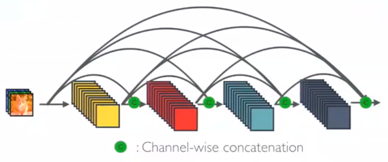
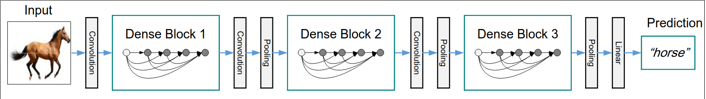
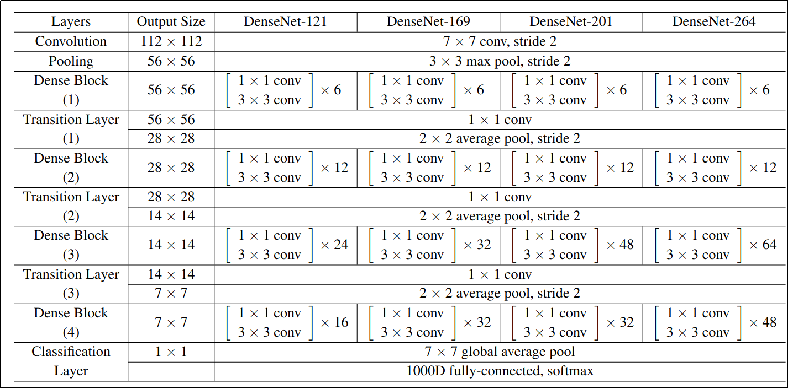

# DenseNet implementation

DenseNet is an algorithm to improve the accuracy of the model by handling the problem of vanishing gradients.

Vanishing problem: when we have a lot of hidden layers between the input layers and the output. The information can vanish in the long chain of hidden layers. 

## DenseNeth architecture </br>


Every layer are simply connecting every layer directly with each other  

In DenseNet architecture, each layer is connected to every other layer. For L layers, there are L(L+1)/2 direct connections. For each layer, the feature maps of all the preceding layers are used as inputs, and its own feature maps are used as input for each subsequent layers.




## The pipline

1. input image 224, 224, 3
1. convolutional layer [7 x 7], stride 2
1. pooling layer  [3 x 3], stride 2
1. DenseBlocks:
    - DenseBlock1 [6 layers]
    - DenseBlock2 [12]
    - DenseBlock3 [24]
    - DenseBlock4 [16]
1. Transition layers:
    - TL 1
    - TL 2
    - TL 3
1. Global Average Pool [7 x 7]
1. Fully connected layer 

## DenseBlock architecture

- Inside of DB each layer is connected to every other layer.
- Each layer receives the feature maps from the previous layer.
- Each layer adds some features eon top of the existing feature maps.
- The output layer have the concatenated feature maps from all the convolutional layer
- **To perform the concatenation**  the size of the feature maps that we concatenating should be the same.
- All concatenated feature maps will fo to Transition Layer

## Transition Layer

- Input layer for TL is the output feature maps from the Dense Block
- Used to down sample the feature maps which it receives from the Dense Block
- The output down-sampled feature maps will go to the next Dense Block

## Convolution Layer [3 x 3]

Each convolution layer is consist of:

1. Batch Normalization
1. ReLu
1. Conv 3 x 3
1. Drop Out



1. Convolution Layer:
1. Max pooling layer: 
1. Dense Block with vary number of layers:
    - 121 - [6, 12, 24, 16] layers
    - 169 - [6, 12, 32, 32] layers
    - 201 - [6, 12, 48, 32] layers
    - 264 - [6, 12, 64, 48] layers
1. Transition Layer 1, 2, 3 are the layer between the Dense Blocks
    - Convolution [1 x 1]
        - Batch Norm
        - ReLu
        - Convolution. (1x1 performs the down-sampling from input_features to output_features)
        - Drop Out
    - Pooling [2 x 2], stride 2
1. Classification Layer. It accept all feature map of all the network layers to perform classification.


**BottleNeck** Layers
Each layer produce **k** feature maps which are then concatenated to previouse feature maps. So, the number of inputs are quite high.
 
## Why DenseNet ?

1. Features learned by layer 1 are directly accessible by layer 4
1. LAyer 4 does not need to relearn a feature by learnt by layer 1 because it can access that information directly via concatenation.
1. Growth rate - how much information we want to add to the network by each layer 

**Example**
if Growth rate k =3 than each convolution layer can add 3 feature maps to the existing feature maps. It is mean Conv 1 in DB can produce only 4 feature maps, Conv layer 2 ->  3 + 3 = 6 and so on. The last conv layer 6 produces 3*6 = 18
    
## How to Train?

```python3 src/torch/train.py --model_arch_name "densenet121"```