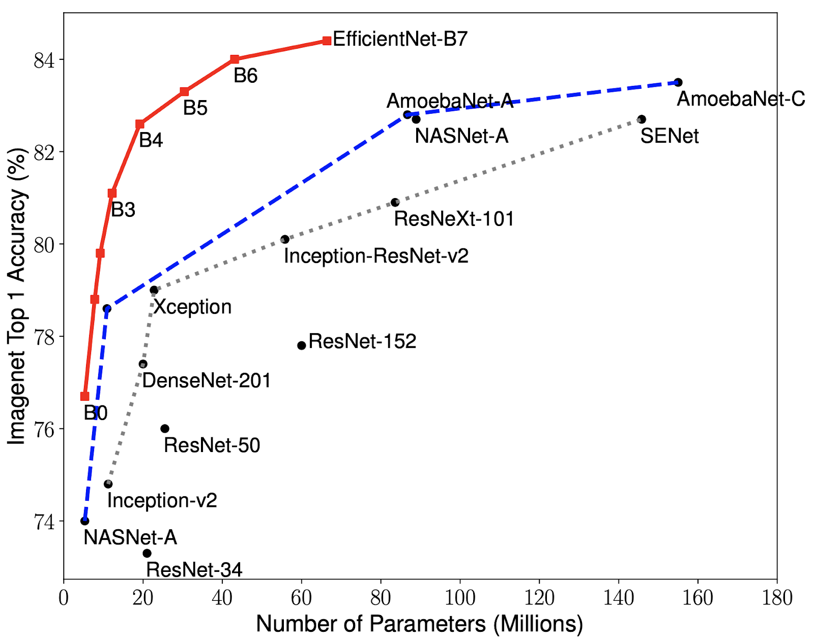

# EfficientNet Model in PyTorch for AI4Climate

Introduced in 2019 in  https://arxiv.org/abs/1905.11946

Note this model developed by Google. It uses for image classification.

## Why do I choose EfficientNet?

**EfficientNet perform scaling on:**
-**Resolution**. We always want to work with a high resolution.
-**Depth**. If we have high resolution, we need more NN with bigger depth.
-**Width**. Each image contains more features. So, Increasing of number of channels (feature maps) in image.
**In order to pursue better accuracy it is critical to balance all dimensions of NN width, depth and resolution.**

### Compound scaling

$$f = \alpha \times \beta^\phi \times \gamma ^\phi = d\times w\times r,$$
$f$ - is a network scaling factor,
$\alpha$ - is a depth scaling factor,
$\beta$ - is a width scaling factor,
$\gamma$ - is a resolution scaling factor.
**[$\alpha$, $\beta$, $\gamma$] are the constants** determined by a small **grid search** on the original small model.
**EfficientNet models:**
- EfficientNet-B0 (d = 1.2, w = 1.1, r = 1.15, phi = 1).
If the resolution of the image increase by 15% than depth and width will increase, correspondently.
- ...
- EfficientNet-B7

MBConv - 

### EfficientNet B0 architecture

# Define and import model archirtectuire 

# Create Fully Connected Network

# Set Device

# Hyperporameters

# Load Data from the disk

# Initialize Network

# Loss and optimizer

# Train Network

# Check accuracy on training and test to see how good the model