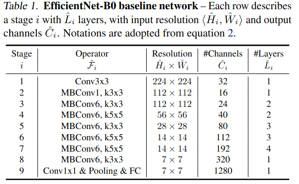

# Train an EfficientNet Model in PyTorch for AI4Climate

We apply an EfficientNet model available in pytorch image models (timm) to identify flooded water in the test datasets. 
EfficientNet designed based on the base model B0 

# Define and import model archirtectuire 

# Create Fully Connected Network

# Set Device

# Hyperporameters

# Load Data from the disk

# Initialize Network

# Loss and optimizer

# Train Network

# Check accuracy on training and test to see how good the model