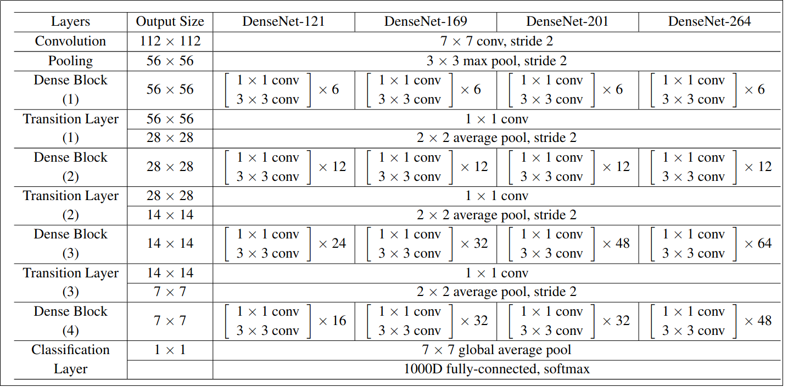

# DenseNet in Pytorch for AI4Climate
Introduced in 2018 in https://arxiv.org/abs/1608.06993
It's an algorithm to improve the accuracy of the model by handling the problem of vanishing gradients (where the information can vanish in the long chain of hidden layers).

Vanishing problem: when we have a lot of hidden layers between the input layers and the output. The information can vanish in the long chain of hidden layers. 




1. Input Image (224, 224, 3)
1. Convolution Layer [7 x 7], stride 2:
1. Max pooling layer [3 x 3], stride 2: 
1. Dense Block with vary number of layers:
    - 121 - [6, 12, 24, 16] layers
    - 169 - [6, 12, 32, 32] layers
    - 201 - [6, 12, 48, 32] layers
    - 264 - [6, 12, 64, 48] layers
1. Transition Layer 1, 2, 3 are the layer between the Dense Blocks:
    - Convolution [1 x 1]
        - Batch Norm
        - ReLu
        - Convolution (1x1 performs down-sampling from input_features to output_features)
        - Drop Out
    - Average Pooling [2 x 2], stride 2
1. Fully connected - Classification Layer. It accept all feature maps of all the network layers to perform classification.

# EfficientNet Model in PyTorch for AI4Climate

Introduced in 2019 in  https://arxiv.org/abs/1905.11946

Note this model developed by Google. It uses for image classification.

EfficientNet perform scaling on:
-Resolution. We always want to work with a high resolution.
-Depth. If we have high resolution, we need more NN with bigger depth.
-Width. Each image contains more features. So, Increasing of number of channels (feature maps) in image.
**In order to pursue better accuracy it is critical to balance all dimensions of NN width, depth and resolution.**

Compound scaling:

$f = \alpha \times \beta^\phi \times \gamma ^\phi = d\times w\times r,$

    $f$ - is a network scaling factor,
    $\alpha$ - is a depth scaling factor,
    $\beta$ - is a width scaling factor,
    $\gamma$ - is a resolution scaling factor.
    
**[$\alpha$, $\beta$, $\gamma$] are the constants** determined by a small **grid search** on the original small model.
**EfficientNet models:**
- EfficientNet-B0 (d = 1.2, w = 1.1, r = 1.15, phi = 1).
If the resolution of the image increase by 15% than depth and width will increase, correspondently.
- ...


## To Test Model 

```
python3 src/models/models.py --model [model type] --[pretrained] --[progress]
```
    model type = ['densenet121', 'densenet169', 'densenet201', 'densenet161', 
    'efficientnet_b0', 'efficientnet_b1', 'efficientnet_b2', 'efficientnet_b3', 
    'efficientnet_b4','efficientnet_b5', 'efficientnet_b6', 'efficientnet_b7']
    
## To Train Model 
Run the following script
```
./train.sh
```


