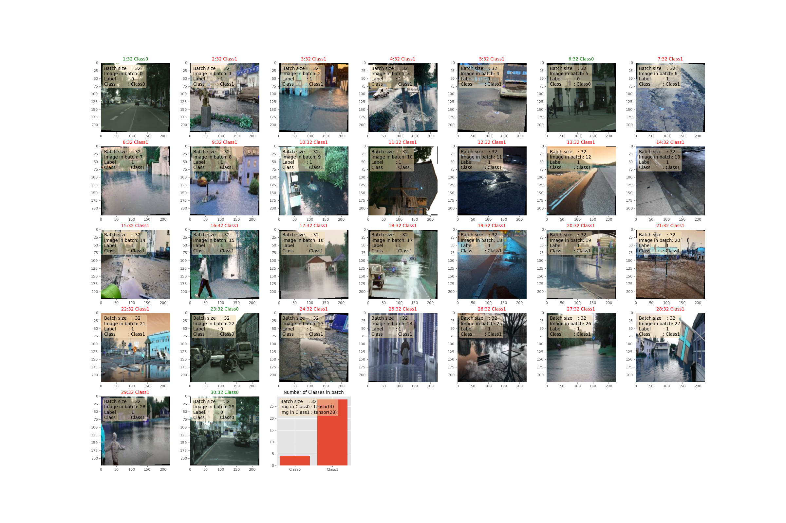
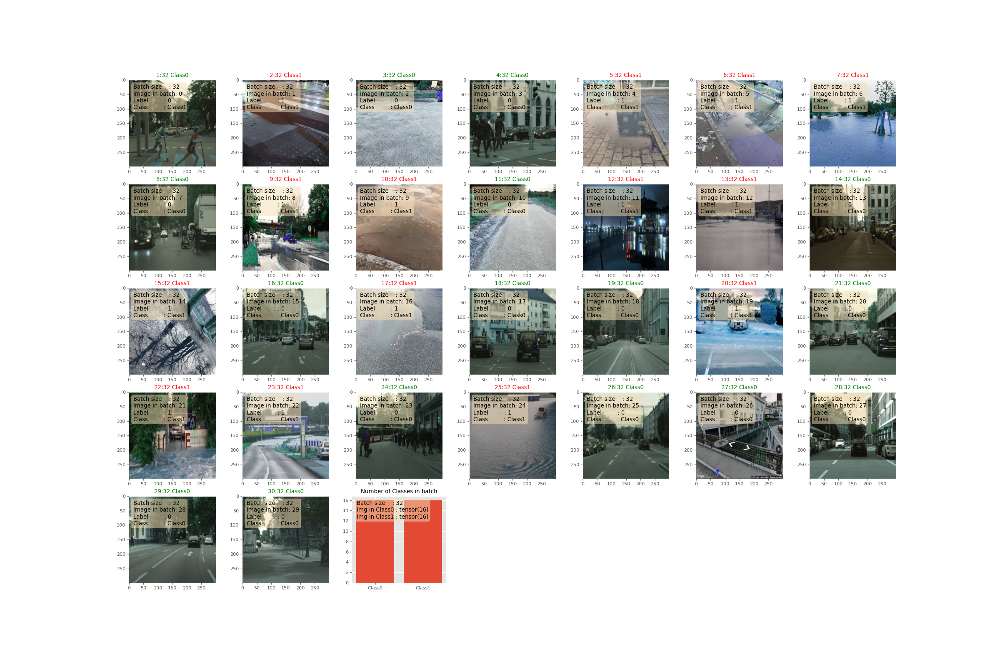
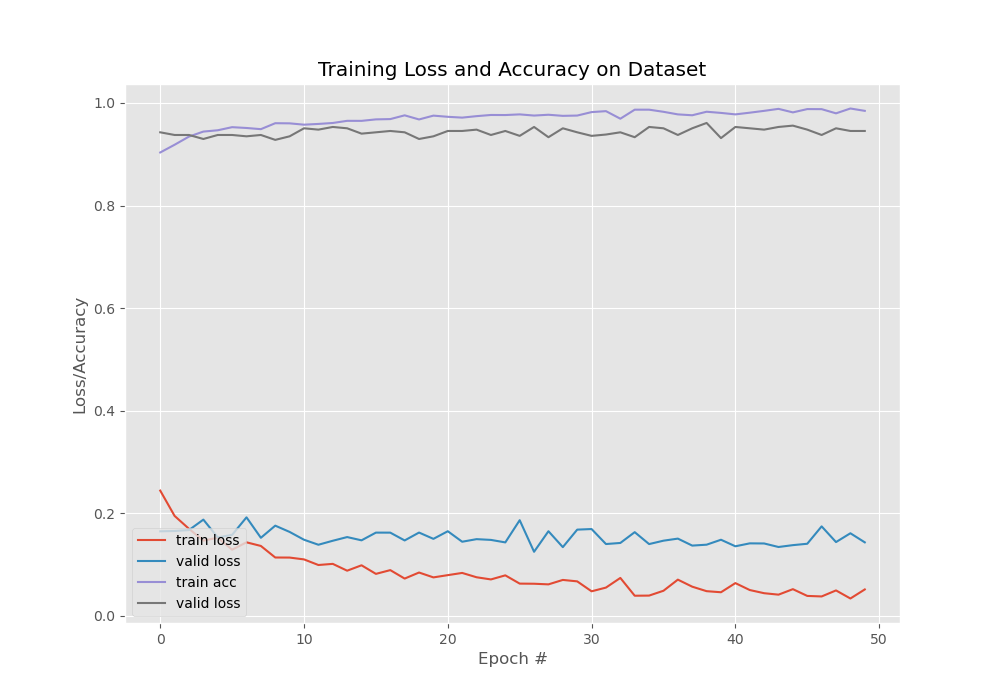
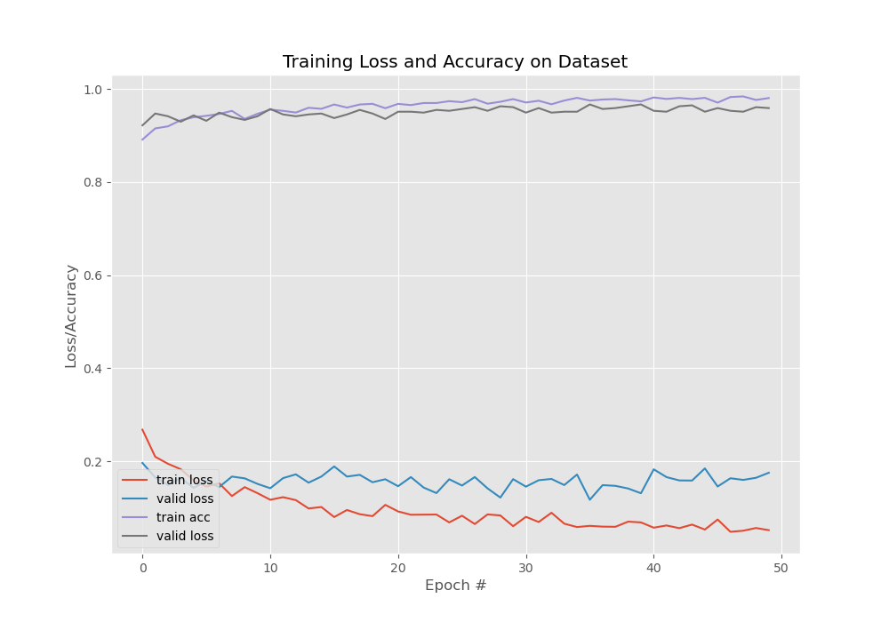
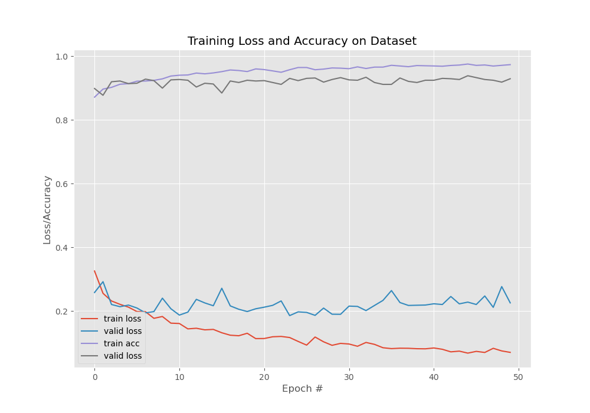

# ML Sets

```python3 src/test_val_train.py```
```root_dir = '/media/igofed/SSD_1T/AI4CI/FULLDATASET/FULLDATASET'```
```csv_file = "annotation.csv"```
By default it is split to 80% -train 10% val, 10% test


## The training Set

It is the set of data that is used to train and make the model learn the hidden features/patterns in the data. In each epoch, the same training data is fed to the NN architecture repeatedly, and the model continues to learn the features of the data. The training set should have a diversified set of inputs so that the model is trained in all scenarios and can predict any unseen data sample that may appear in the future in ..

To plot and save random butch of the dataset run:
```./dataset_test.sh```
it will plot and save batch of [train/valid or plot] images (if specify) on figure ```../figures/[balance]_[mode]_[YYYYMMDD_hhmmss].png```

```dataset='/media/igofed/SSD_2T/DATASETS/weather_4'```
```mode='train'```
```python3 src/torchEfficientNet/train.py --dataset $dataset --model $model ```



## The validation Set

The validation set is a set of data, separate from the training set, that is used to validate our model performance during training. This validation process gives information that helps us tune the model’s hyperparameters and configurations accordingly. It is like a critic telling us whether the training is moving in the right. The validation set is a set of data, separate from the training set, that is used to validate our model performance during training. This validation process gives information that helps us tune the model’s hyperparameters and configurations accordingly.


## The test Set

The test set is a separate set of data used to test the model after completing the training.


### Variant 1 (2493 images)

Full dataset **desktop**, **mobile**
```python3 src/test_val_train.py -source '/media/igofed/SSD_1T/AI4CI/FULLDATASET/FULLDATASET' -csv "annotation.csv" -dest 'weather_1' -type 1```
Accuracy after training EfficientNetB0 model in PyTorch from scratch without pretrained weights.

        Training loss        : 0.052, 
        Training acc         : 0.985, 
        Validation loss      : 0.144, 
        Validation acc       : 0.945



|Dataset     |Train Class0|Train Class1| Test Class0 |Test Class1 | Val Class0 | Val Class1 |
|------------| :-- | :-- | :-- |   :-- |   :-- |   :-- |
|Dataset 1     | 188    | 1553    |  43   |  335     |  28     |   346    |


### Variant 2 (3243 images)

Full dataset **desktop**, **mobile**, **berlin**, **munich**, **mainz**, **zurich**
```python3 src/test_val_train.py -source '/media/igofed/SSD_1T/AI4CI/FULLDATASET/FULLDATASET' -csv "annotation.csv" -dest 'weather_2' -type 2```

        Training loss         : 0.052, 
        Training acc          : 0.980,
        Validation loss       : 0.176, 
        Validation acc        : 0.959



|Dataset     |Train Class0|Train Class1| Test Class0 |Test Class1 | Val Class0 | Val Class1 |
|------------| :-- | :-- | :-- |   :-- |   :-- |   :-- |
|Dataset 2     | 705    | 1549    |  144   |  333     |  160     |   352    |

### Variant 3 (3684 images)

Full dataset **desktop**, **mobile**, **roadway**, **berlin**, **munich**, **mainz**, **zurich**
```python3 src/test_val_train.py -source '/media/igofed/SSD_1T/AI4CI/FULLDATASET/FULLDATASET' -csv "annotation.csv" -dest 'weather_3' -type 3```

        Training loss        : 0.052, 
        Training acc         : 0.980
        Validation loss      : 0.176, 
        validation acc       : 0.959


|Dataset     |Train Class0|Train Class1| Test Class0 |Test Class1 | Val Class0 | Val Class1 |
|------------| :-- | :-- | :-- |   :-- |   :-- |   :-- |
|Dataset 3     | 718    | 1863    |  143   |  395     |  148     |   417    |

### Variant 4 (5549 images)

Full dataset **desktop**, **mobile**, **roadway**, **eu2013**, **berlin**, **munich**, **mainz**, **zurich**
```python3 src/test_val_train.py -source '/media/igofed/SSD_1T/AI4CI/FULLDATASET/FULLDATASET' -csv "annotation.csv" -dest 'weather_4' -type 4```



        Training loss        : 0.070, 
        Training acc         : 0.974,
        Validation loss      : 0.226, 
        Validation acc       : 0.929

|Dataset     |Train Class0|Train Class1| Test Class0 |Test Class1 | Val Class0 | Val Class1 |
|------------| :--  | :--  | :--  |   :-- |   :-- |   :-- |
|Dataset 4 | 901  | 2983 |  205  |  627  |  218   |   615 |
